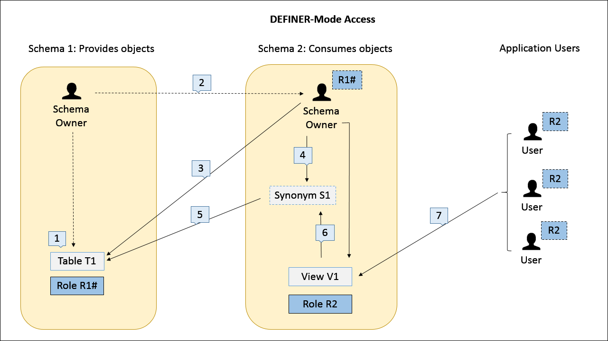
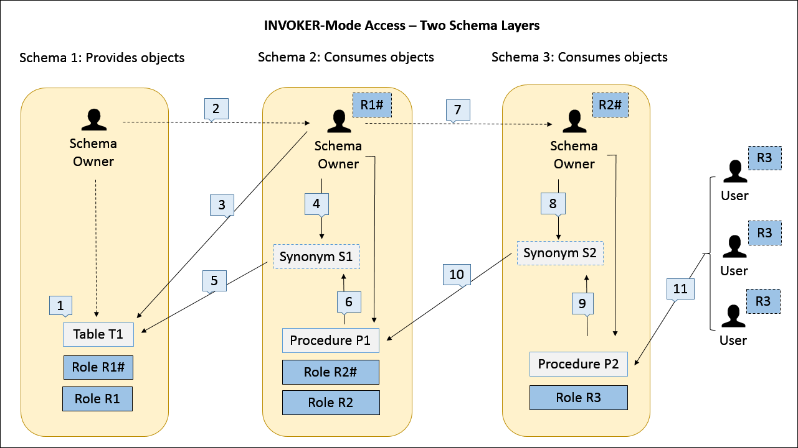

<!-- loioa260b05631a24a759bba932aa6d81b64 -->

# Users, Privileges, and Schemas

A short overview of which properties, users, and privileges are involved when using synonyms in your SAP HANA application.

For security reasons, some database objects can be run in either `DEFINER` or `INVOKER` mode. The security mode is not defined in an access role; it is defined by the database object type, or in the case of a procedure, explicitly. The security mode is determined, in part, by the **type** of database object the application user calls, for example, a view, a synonym, or a procedure. More importantly for this scenario, the security mode also determines which privileges need to be specified in the user role required to access the database object.

-   [Definer-Mode Access](users-privileges-and-schemas-a260b05.md#loioa260b05631a24a759bba932aa6d81b64__section_q5q_3r2_hy)

-   [Invoker-Mode Access](users-privileges-and-schemas-a260b05.md#loioa260b05631a24a759bba932aa6d81b64__section_snx_3r2_hy)

> ### Tip:  
> In the default DEFINER security mode, a database object \(for example, a definer-mode procedure or a view\) is executed with the privileges assigned to the object's owner. In the INVOKER security mode, a database object \(for example, an invoker-mode procedure or a user-defined function \(UDF\)\) is executed with the privileges assigned to the user who calls it. For more information about authorization checks on objects with dependencies, see the *Object Privileges* section in the *SAP HANA Security Guide*, which is listed in *Related Information* below.

It is highly recommended to define object privileges in roles which can then be used to assign privileges for the target base object. This is particularly important for scenarios where the target base object is removed for some reason.

If a synonym's target base object \(for example, a table or a view\) is dropped and recreated, the corresponding object privilege has to be granted individually again to all referenced users. However, in most scenarios, the users consuming the target base object \(indirectly via the synonym\) are not known.

By using roles that include the object privilege, it is only necessary to reassign the object privilege to the respective role. All referencing users automatically receive the object privilege via their assigned roles.

<a name="loioa260b05631a24a759bba932aa6d81b64__section_q5q_3r2_hy"/>

## Definer-Mode Access

The following diagram illustrates the users and privileges that are involved when setting up and using synonyms to enable “DEFINER”-mode access to database objects in an external schema \(or another container\):

The various roles illustrated in the diagram are described in the following list:

-   `Role R1#`
    -   `SELECT` privilege on `Table T1` with `GRANT OPTION`

        Assigned to the owner of the schema that contains the consuming objects, for example, the synonym S1

-   `Role R2`
    -   `SELECT` privilege on `View V1`

        Assigned to the user of the application. This user is then able to access to the objects exposed by `Role R2`

> ### Tip:  
> In the default “DEFINER” mode, a database object is executed with the privileges assigned to the object's owner; that is, the user who defines the object.

The following table provides more detailed information concerning the process of setting up and using synonyms:

**Synonym Users and Privileges for DEFINER-Mode Access**

<table>
<tr>
<th valign="top">

Step

</th>
<th valign="top">

Action

</th>
<th valign="top">

Comments

</th>
</tr>
<tr>
<td valign="top">

1

</td>
<td valign="top">

Create base target objects “`Table T1`” and role “`Role R1#`”.

</td>
<td valign="top">

Synonyms can be created for other database objects, too, for example: tables, views, procedures, table functions, scalar functions, and sequences.

`Role R1#` assigns the `SELECT` privilege on `Table T1` with `GRANT OPTION`

</td>
</tr>
<tr>
<td valign="top">

2

</td>
<td valign="top">

Grant privileges to “`Schema2`” owner.

</td>
<td valign="top">

Use `RoleR1#.hdbrole` to assign the required privileges.

> ### Tip:  
> The “Schema Owner” in “`Schema2`” is the <code>“object_owner”</code> in the `hdbgrants` file.

</td>
</tr>
<tr>
<td valign="top">

3

</td>
<td valign="top">

Ensure the owner of “`Schema2`” has access to “`Table T1`” 

</td>
<td valign="top">

The owner requires `SELECT` privilege on `Table T1` with `GRANT OPTION` which is defined in `Role R1#`.

</td>
</tr>
<tr>
<td valign="top">

4

</td>
<td valign="top">

Create “`Synonym S1`” \(and role “`Role R2`”\).

</td>
<td valign="top">

When creating a synonym, the `SELECT` privilege is required for the DEFINER-mode access to the table, view, or sequence referenced as a base object.

`Role R2` defines the privileges required by an application user to access the `View V1`.

</td>
</tr>
<tr>
<td valign="top">

5

</td>
<td valign="top">

Use “`Synonym S1`” to access “`Table T1`”.

</td>
<td valign="top">

To access objects within an HDI-container, only private \(i.e. schema-local\) synonyms can be used.

</td>
</tr>
<tr>
<td valign="top">

6

</td>
<td valign="top">

Create a view to access “`Synonym S1`”.

</td>
<td valign="top">

 “`View V1`” references “`Synonym S1`”.

</td>
</tr>
<tr>
<td valign="top">

7

</td>
<td valign="top">

Application users can access “`Table T1`” in “`Schema 1`” via “`View V1`” in “`Schema 2`” 

</td>
<td valign="top">

Requires the `SELECT` privilege on “`View V1`”; this is defined in `Role R2`.

`SELECT` privilege on `Table T1` is defined in `Role R1#`\)

> ### Tip:  
> User access to “`View V1`” is enabled using the technical user `application_user` \(with the global `access_role`\).

</td>
</tr>
</table>

<a name="loioa260b05631a24a759bba932aa6d81b64__section_snx_3r2_hy"/>

## Invoker-Mode Access

The following diagram illustrates the users and privileges that are involved when using synonyms to enable “INVOKER”-mode access to database objects in an external schema \(or another container\):

The various roles illustrated in the diagram for “INVOKER”-mode access are described in the following list:

-   `Role R1`

    Assigned to the user of the application that consumes the underlying target objects

    -   `SELECT` privilege on `Table T1`

-   `Role R1#`

    Assigned to the owner of schema 2 which contains the consuming objects procedure P1 and synonym S1

    -   `SELECT` privilege `with GRANT OPTION` on `Table T1` 

-   `Role R2`

    Assigned to the user of the application that consumes the underlying target objects

    -   `EXECUTE` privilege on `Procedure P1`

    -   The privileges defined in `Role R1` \(`INVOKER` mode only\)

-   `Role R2#`

    Assigned to the owner of schema 3 which contains the consuming objects

    -   `EXECUTE` privilege `with GRANT OPTION` on `Procedure P1`

    -   The privileges defined in `Role R1#` \(`INVOKER` mode only\)

-   `Role R3`

    Assigned to the user of the application that consumes the underlying target objects

    -   `EXECUTE` privilege on `Procedure P2`

    -   The privileges defined in `Role R2` \(`INVOKER` mode only\)

    -   The privileges defined in `Role R1` \(`INVOKER` mode only\); this is included in Role R2

> ### Tip:  
> In “INVOKER” mode, a database object \(for example, an invoker-mode procedure or a user-defined function \(UDF\)\) is executed with the privileges assigned to the user who starts it.

The following table provides more detailed information concerning the process of setting up and using multiple synonyms to enable access to INVOKER-mode database objects:

**Synonym Users and Privileges for INVOKER-Mode Access**

<table>
<tr>
<th valign="top">

Step

</th>
<th valign="top">

Action

</th>
<th valign="top">

Comments

</th>
</tr>
<tr>
<td valign="top">

1

</td>
<td valign="top">

Create base target objects “`Table T1`” as well as “`Role R1`” and “`Role R1#`”.

</td>
<td valign="top">

Synonyms can be created for other database objects, too, for example: tables, views, procedures, table functions, scalar functions, and sequences.

`Role R1` assigns the `SELECT` privilege on `Table T1`

`Role R1#` assigns the `SELECT` privilege on `Table T1` with `GRANT OPTION`

</td>
</tr>
<tr>
<td valign="top">

2

</td>
<td valign="top">

Assign access privileges to the owner of “`Schema2`”.

</td>
<td valign="top">

Use `RoleR1#.hdbrole` to assign the required privileges.

> ### Tip:  
> The “Schema Owner” in “`Schema2`” is the <code>“object_owner”</code> in the `hdbgrants` file.

</td>
</tr>
<tr>
<td valign="top">

3

</td>
<td valign="top">

Ensure the owner of “`Schema2`” has access to “`Table T1`” 

</td>
<td valign="top">

 `Role R1#` includes the `SELECT` privilege `WITH GRANT OPTION` on `Table T1`.

</td>
</tr>
<tr>
<td valign="top">

4

</td>
<td valign="top">

Create “`Synonym S1`”, “`Role R2`”, and “`Role R2#`”.

</td>
<td valign="top">

“`Role R2`” defines the `EXECUTE` privilege on `Procedure P1` and includes a reference to the privileges defined in `Role R1` \(`INVOKER` mode only\)

“`Role R2#`” defines the `EXECUTE` privilege `with GRANT OPTION` on `Procedure P1`and also includes a reference to the privileges defined in `Role R1#` \(INVOKER mode only\)

</td>
</tr>
<tr>
<td valign="top">

5

</td>
<td valign="top">

Use “`Synonym S1`” to access “`Table T1`”.

</td>
<td valign="top">

When creating a synonym, the `SELECT` privilege is required for the table, view, or sequence referenced as a base object; for procedures and functions that are referenced as a base object, the `EXECUTE` privilege is required.

> ### Restriction:  
> To access objects within an HDI-container, only private \(schema-local\) synonyms can be used.

</td>
</tr>
<tr>
<td valign="top">

6

</td>
<td valign="top">

Create an INVOKER-mode procedure “`Procedure P1`” to access “`Synonym S1`”.

</td>
<td valign="top">

 “`Procedure P1`” references “`Synonym S1`” 

</td>
</tr>
<tr>
<td valign="top">

7

</td>
<td valign="top">

Assign access privileges to the owner of “`Schema 3`”.

> ### Tip:  
> The “Schema Owner” in “`Schema3`” is the <code>“object_owner”</code> in the `hdbgrants` file; the user\(s\) in “`Schema3`” are the technical user <code>“application_user”</code>.

</td>
<td valign="top">

Use a database role object, for example, role `RoleR2.hdbrole`.

> ### Note:  
> The role definition `RoleR2.hdbrole` must ensure that the owner of Schema 3 has the grant option and can assign privileges for access to “`Procedure P1`” in Schema 2.

</td>
</tr>
<tr>
<td valign="top">

8

</td>
<td valign="top">

Create “`Synonym S2`” and “`Role R3`”.

</td>
<td valign="top">

`Synonym S2` provides access to `Procedure P1` which calls `Synonym S1`.

`Role R3` defines the privileges required for `INVOKER` mode access to `Procedure P2`. `Role R3` must also include a reference to `Role R2`, which in turn includes `Role R1`.

</td>
</tr>
<tr>
<td valign="top">

9

</td>
<td valign="top">

Create an INVOKER-mode procedure “`Procedure P2`” to access “`Synonym S2`”.

</td>
<td valign="top">

As explained in a previous step, a synonym cannot be used as the base object for another synonym.

</td>
</tr>
<tr>
<td valign="top">

10

</td>
<td valign="top">

Enable access to base object `Table T1` from Schema 3.

</td>
<td valign="top">

Requires the following privileges:

-   Role R1: SELECT ON T1

    Role R1\#: SELECT ON T1 WITH GRANT OPTION

-   Role R2: EXECUTE ON P1 + Role R1

    Role R2\#: EXECUTE ON P1 WITH GRANT OPTION + Role R1\#

-   Role R3: EXECUTE ON P2 + Role R2 + Role R1

</td>
</tr>
<tr>
<td valign="top">

11

</td>
<td valign="top">

Assign access privileges to the application users.

</td>
<td valign="top">

Access privileges are defined in `Role R3`.

> ### Tip:  
> In the `hdbgrants` file, the user\(s\) in “`Schema3`” are the technical user <code>“application_user”</code>.

</td>
</tr>
</table>

**Related Information**  

[Enable Access to Objects in a Remote Classic Schema](enable-access-to-objects-in-a-remote-classic-schema-402944b.md "Use a synonym to enable access to objects in a remote schema that is not managed by your Cloud Foundry application (for example, ERP).")

[Database Synonyms in SAP HANA Cloud](database-synonyms-in-sap-hana-cloud-556452c.md "You can use synonyms in SAP HANA Cloud to enable access to objects that are not in the same schema or application container.")

[Syntax Options in the hdbgrants File](syntax-options-in-the-hdbgrants-file-f49c1f5.md "Assign the privileges required by users to access objects in the target schema.")

[SAP HANA Security Guide (Authorization, Object Privileges)](https://help.sap.com/viewer/a1317de16a1e41a6b0ff81849d80713c/2023_2_QRC/en-US/c3d9889e3c9843bdb834e9eb56f1b041.html#loioc3d9889e3c9843bdb834e9eb56f1b041 "The SAP HANA Cloud, SAP HANA Database Security Guide is the entry point for all information relating to the secure operation and configuration of SAP HANA Cloud, SAP HANA database.") :arrow_upper_right:

