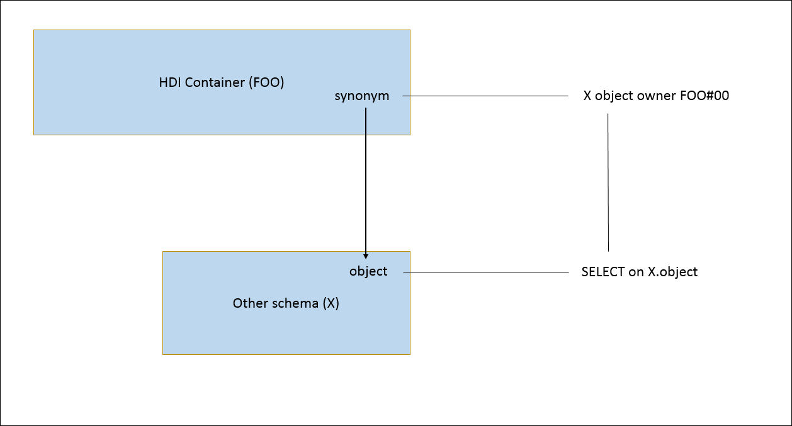

<!-- loio79e8664e99dd4cf98719e7e4e44642e3 -->

# Permissions for Objects in HDI Containers

The owner of a container object needs additional privileges to the ones assigned by default.

By default, an HDI container is assigned very few database privileges. For example, the object owner \( “`#OO`” user\) is only assigned the `CREATE ANY` privilege on the container's run-time schema \(schema “FOO” for an HDI container “FOO” \). To access database objects inside other database schemata or other HDI containers, and to be able to deploy synonyms into the HDI container which point to objects outside the container, the object owner needs additional privileges. For example, for an object “`object`” in schema “X”, the `SELECT` privilege on “`X.object`” :




<a name="loio79e8664e99dd4cf98719e7e4e44642e3__section_vxg_zyz_m4b"/>

## The hdbgrants File

To assign privileges automatically to the object owner and \(or\) the application binding users, the HDI Deployer provides `.hdbgrants` files, which use a syntax that is similar to the `.hdbrole` artifact. The following example shows the structure of an `.hdbgrants` file:

> ### Code Syntax:  
> `granting-service.hdbgrants`
> 
> ```
> {
>   "granting-service": { 
>     "object_owner": { 
>       <privileges> 
>     }, 
>     "application_user": { 
>       <privileges> 
>     }
>   }
> } 
> ```

The top-level keys define the grantors; the names of the bound services which **grant** the privileges, <code>“granting-service”</code> in the code example above. The next level defines the users to whom the privileges are granted, these are the grantees: <code>“object_owner”</code> is used to specify the HDI container's object owner, and <code>“application_user”</code> defines the application users who are bound to the application modules, for example, the Node.js module in an MTA. The third level defines the set of privileges to grant using a structure that is similar to the format used in a `.hdbrole` role-definition file.

> ### Note:  
> For backwards compatibility, the suffix `.hdbsynonymgrantor` is also supported.

On startup, the HDI Deployer looks for files with the `.hdbgrants` suffix and processes them in the following way: For each grantor specified in the `.hdbgrants` file, the HDI Deployer looks up a bound service with the specified name \(subject to service replacements\), connects to the database with the service's credentials, and grants the specified privileges to the grantees.

> ### Code Syntax:  
> Example `cfg/SYS-access.hdbgrants` File with Some Privileges
> 
> ```
> {
>   "SYS-access": {
>     "object_owner": {
>       "object_privileges":[
>         {
>           "schema": "SYS",
>           "name": "VIEWS",
>           "privileges_with_grant_option": ["SELECT"]
>         },
>         {
>           "schema": "SYS",
>           "name": "TABLES",
>           "privileges_with_grant_option": ["SELECT"]
>         }
>       ]
>     },
>     "application_user": {
>       "object_privileges":[
>         {
>           "schema": "SYS",
>           "name": "VIEWS",
>           "privileges": ["SELECT"]
>         },
>         {
>           "schema": "SYS",
>           "name": "TABLES",
>           "privileges": ["SELECT"]
>         }
>       ]
>     }
>   }
> }
> 
> ```

In the default `DEFINER` security mode, a database object \(like a definer-mode procedure or a view\) is executed using the privileges assigned to the object's owner. To enable the application user to select from the view, the object owner needs access privileges to the underlying `"TABLES"` \(with grants option\). These privileges can be assigned using the property, `"privileges_with_grant_option"`, as illustrated in the example above.


<a name="loio79e8664e99dd4cf98719e7e4e44642e3__section_r24_1zz_m4b"/>

## The hdbrevokes File

Starting with version 3.8, the HDI deployer enables the assignment of revoking rights. Any privileges that can be granted by means of the `.hdbgrants` file can be revoked with the `.hdbrevokes` file. Both the `.hdbgrants` and the `.hdbrevokes` file share the same structure.

> ### Note:  
> If both files exist, the `.hdbrevokes` file is processed before the `.hdbgrants` file.

> ### Code Syntax:  
> `revoking-service.hdbrevokes`
> 
> ```
> {
>   "revoking-service": { 
>     "object_owner": { 
>       <privileges> 
>     }, 
>     "application_user": { 
>       <privileges> 
>     }
>   }
> } 
> ```

**Related Information**  


[Configuring the HDI Deployer](configuring-the-hdi-deployer-d5bf65e.md "Set up and use the Node.js-based HDI Deployer in Cloud Foundry.")

[Integrate the HDI Deployer into a Mutlitarget Application's Database Module](integrate-the-hdi-deployer-into-a-mutlitarget-application-s-database-modu-0194390.md "Install the HDI Deployer for use by a Multi-Target Application (MTA).")

[Permissions for Objects in HDI Containers](permissions-for-objects-in-hdi-containers-79e8664.md "The owner of a container object needs additional privileges to the ones assigned by default.")

[Granting Roles and Privileges for Use with Synonyms](granting-roles-and-privileges-for-use-with-synonyms-f7381cc.md "Assigning roles and privileges to object owners for applications that use synonyms to access external objects.")

[Syntax Options in the hdbgrants File](syntax-options-in-the-hdbgrants-file-f49c1f5.md "Assign the privileges required by users to access objects in the target schema.")

